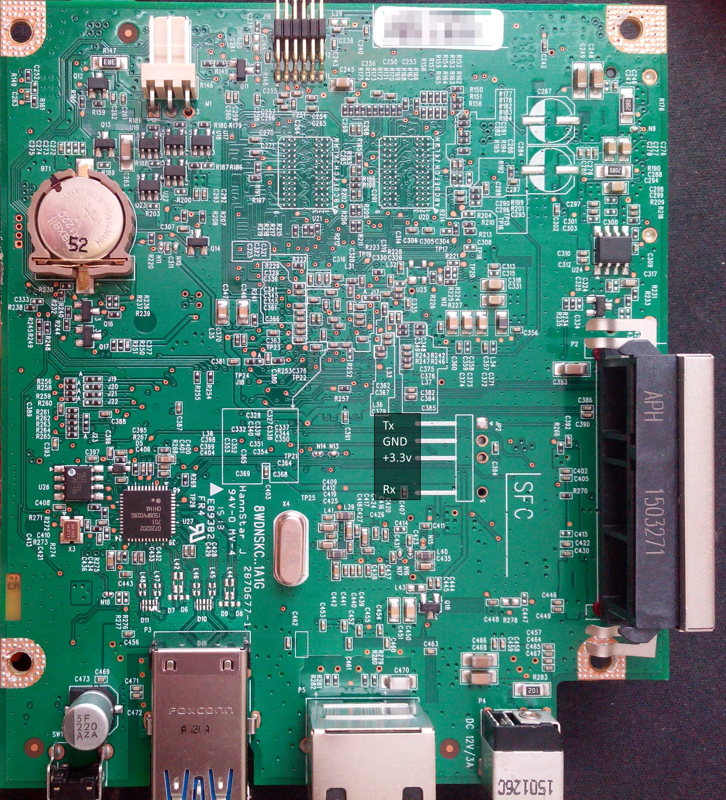

# KC-YCDI

This is the most tricky part of the guide, but you will understand the benefit and the skill you learnt at the end of the procedure.

## You need:
1. to disassemble your device
2. get access to the serial pins
3. solder 3 dupont cables
4. connect the serial to another device; I used a Rasperry PI with a "USB to UART" [^1] serial adapter.

## Disassemble your device

There are no specific instruction, here. You just need some patience and unscrew it.
In My device there are just 4 main screws:
+ 2 visible on top near the disk enclosure
+ 2 on the base, accessible after you remove the plastic cover

Then you need to unscrew the metal chassis and to get access to the board.

## Get access to the serial pins

The board has a space dedicated to the serial connection. See this picture:

Should your board be different, WD adopt the convention of keeping the same drawing for the serial connection.

If you are unsecure about which is the right pint, continue to the next step with the soldering and then you can try to connect to the _USB to UART_ device.
If you used a powered _USB to UART_ you can avoid to solder and connect the +3.3V; as these are TTL signals there is no risk you can burn the serial circuits in case of wrong connection of the other 3 pins (GND, Tx and Rx).

3. solder 3 dupont cables

Yes, you need it :roll_eyes:

The simplest tip is to use 3 dupont cable (_male to male_ or _male to female_ ~10 cm).
You shall put the male end in the small hole and then put the tin and solder on it; wait few second the tin is meld and remove the solder blowing as much as you can : )
One tip; before putting the male pin, you can use pliers and give it a "L form"; in thiw ways, you can have the wire laying parallel to the board and just the pin endpoint entering the hole. You will gain stability during the soldering and furthermore you can leave the dupont cable also after reassembling the device.
Just sold the GND, the TX and the RX pins; there no need to solder also the +3.3 V (assuming your _USB to UART_ is powered).

[^1]: Just google _UST to UART_ on google or amazon

